# 🛡️ ZABET (ظابط) - All-in-One Gym & Productivity Companion

[](https://flutter.dev/)
[](https://dart.dev/)
[](https://www.android.com/)
[](#)

**ZABET** is a feature-rich, multi-utility mobile application designed to streamline daily productivity and workout management. Built using Flutter and Dart, the app integrates workout timing, task organization, notes, and daily essential utilities into a sleek, fast, and responsive user interface.

---

## ✨ Key Features

* **🏋️ Gym Rest Timer & Live Tracking**
    * Real-time workout rest timer with quick time adjustments (+30s / -15s).
    * Preset duration shortcuts for quick rest intervals (30s, 60s, 90s, 2m, 3m).
    * Foreground live status notifications with background execution support.

* **📝 Task & Notes Management**
    * Clean and interactive To-Do lists to stay organized.
    * Quick notes editor to capture thoughts on the go.

* **⚡ Integrated Everyday Utilities**
    * Built-in Calculator, Stopwatch, Alarms, and Flashlight toggles.

* **🌐 Dual Language & Persistent Onboarding**
    * Seamless Arabic & English localization switching.
    * Smart onboarding preference caching (`SharedPreferences`).

---

## 🛠️ Tech Stack & Architecture

* **Framework:** [Flutter](https://flutter.dev) (Dart)
* **Localization:** `easy_localization` (Arabic / English)
* **Local Notifications:** `flutter_local_notifications`
* **Local Storage & Caching:** `shared_preferences`
* **UI & Animation:** Custom UI components, pulse animation controllers, Material 3 design elements.

---

## 📸 App Screenshots

<div align="center">
  <table>
    <tr>
      <td align="center">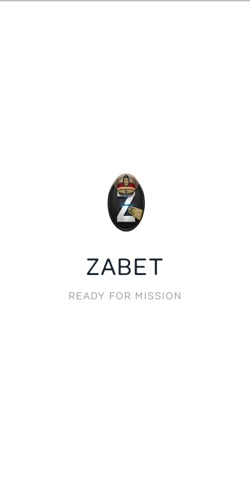<br/><sub>Screen 1</sub></td>
      <td align="center">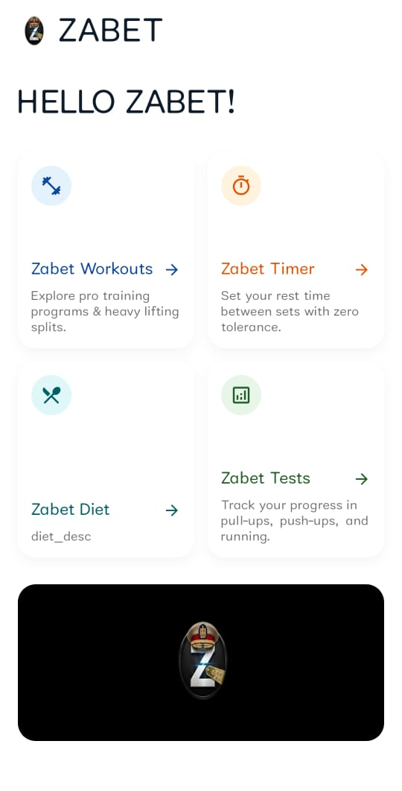<br/><sub>Screen 2</sub></td>
      <td align="center">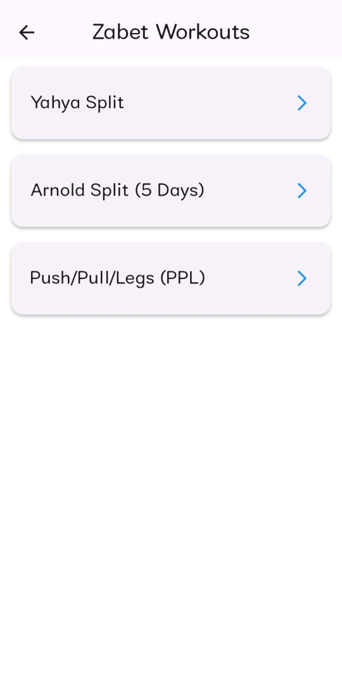<br/><sub>Screen 3</sub></td>
    </tr>
    <tr>
      <td align="center">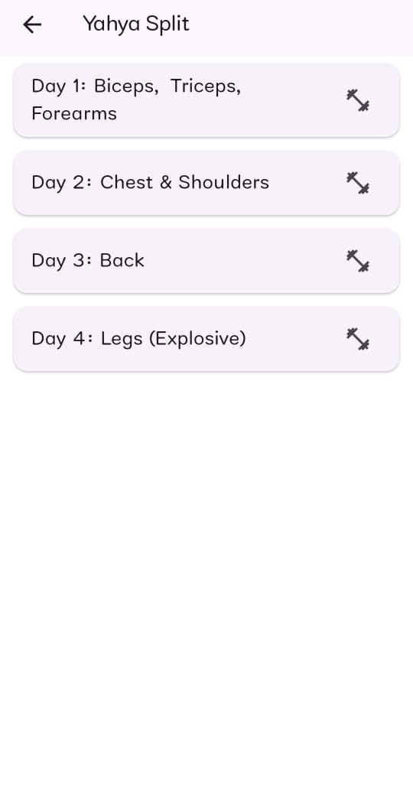<br/><sub>Screen 4</sub></td>
      <td align="center">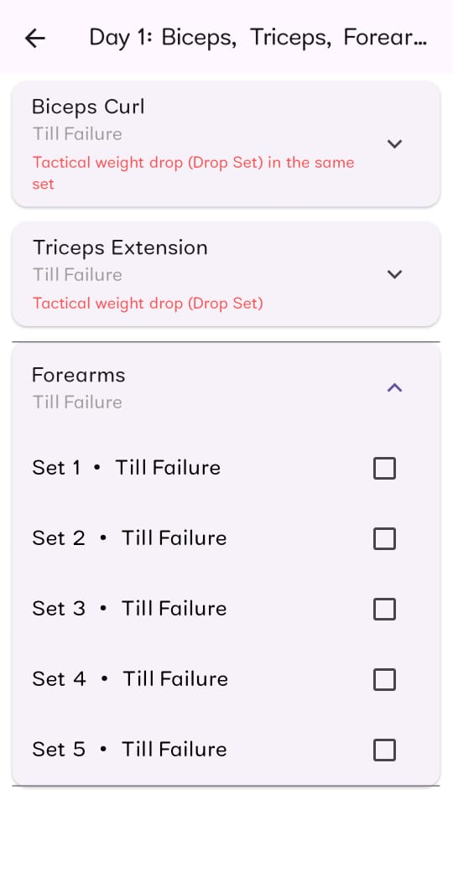<br/><sub>Screen 5</sub></td>
      <td align="center">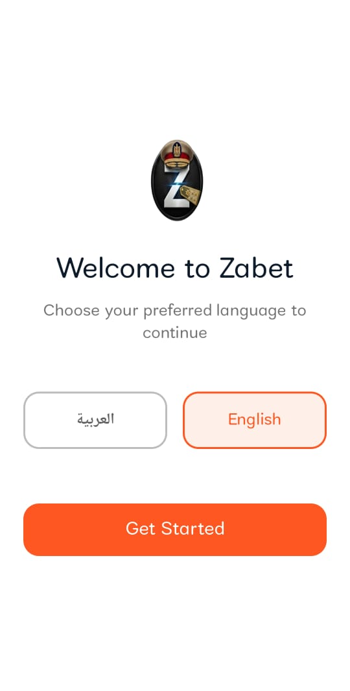<br/><sub>Screen 6</sub></td>
    </tr>
    <tr>
      <td align="center">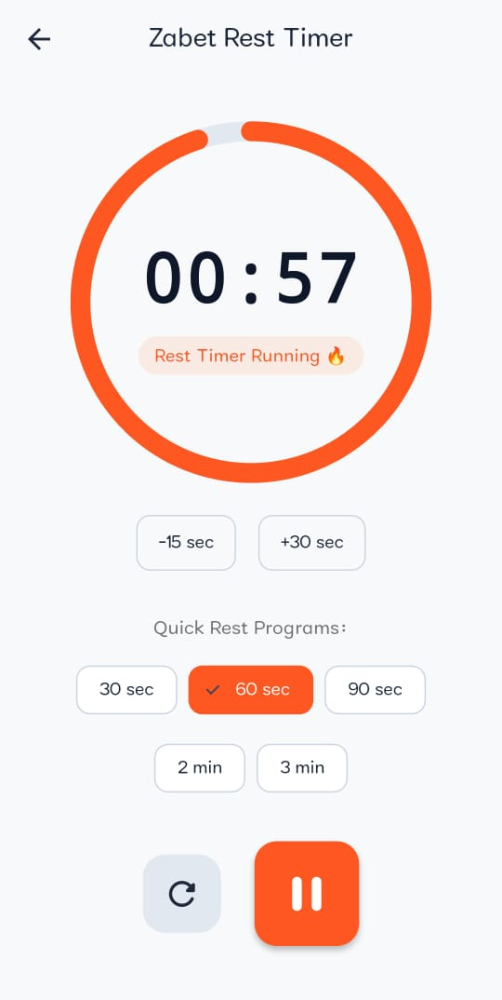<br/><sub>Screen 7</sub></td>
      <td align="center">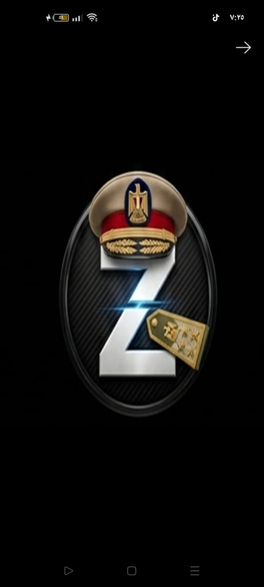<br/><sub>Screen 8</sub></td>
      <td align="center">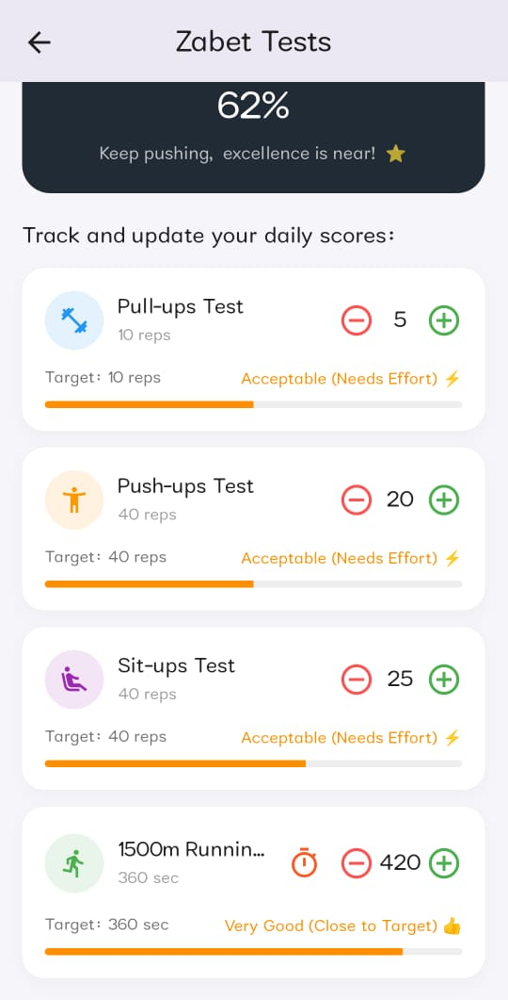<br/><sub>Screen 9</sub></td>
    </tr>
    <tr>
      <td align="center">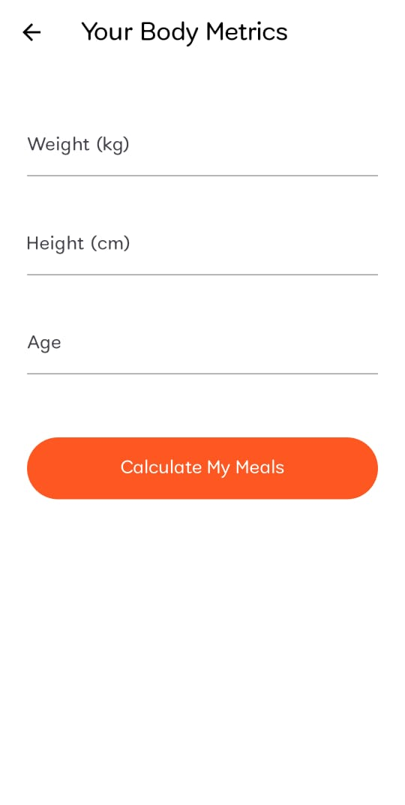<br/><sub>Screen 10</sub></td>
      <td align="center">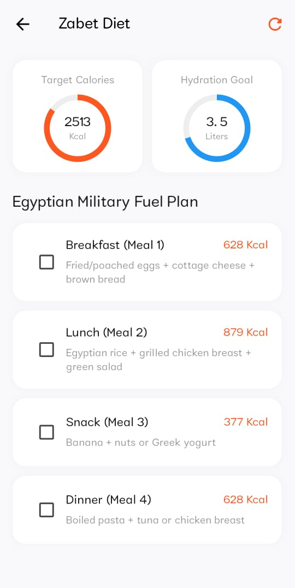<br/><sub>Screen 11</sub></td>
      <td align="center">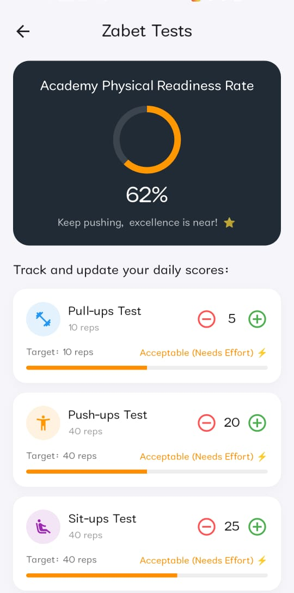<br/><sub>Screen 12</sub></td>
    </tr>
  </table>
</div>

---

## 🚀 Getting Started

To clone and run this application locally, follow these steps:

### Prerequisites
* Flutter SDK (3.x or higher)
* Android Studio / VS Code / Project IDX
* Android Device or Emulator (API 21+)

### Installation

1. **Clone the repository:**
   ```bash
   git clone [https://github.com/your-username/ZABET.git](https://github.com/your-username/ZABET.git)
   ## 👨‍💻 Developer & Contact
Developed with ❤️ by Yehia.

WhatsApp: +20 155 342 7179

📄 License
This project is developed for portfolio and personal application usage.