# 🛡️ ZABET (ظابط) - All-in-One Gym & Productivity Companion

## 💡 The Problem & How ZABET Solves It

### 🔴 The Problem
When going to the gym or managing a busy day, people usually have to juggle multiple standalone apps: one app for tracking workout rest times, another for notes, a separate one for daily utilities (like calculators or stopwatches), and dealing with language barriers if an app doesn't support their native tongue. Switching constantly between multiple cluttered apps ruins focus, wastes time, and creates a frustrating user experience.

### 🟢 How ZABET Solves It
**ZABET** brings everything together under one roof into a single, seamless, and lightning-fast mobile application. Instead of forcing users to scatter their workflow across 4 or 5 different apps, ZABET provides an all-in-one ecosystem where they can manage gym rest timers, notes, to-do lists, and everyday utilities instantly in one place. With native support for 8 different languages right from the onboarding screen, it removes language friction and delivers a clean, unified, and distraction-free experience tailored for daily productivity.

---

**ZABET** is a feature-rich, multi-utility mobile application designed to streamline daily productivity and workout management. Built using Flutter and Dart, the app integrates workout timing, task organization, notes, and daily essential utilities into a sleek, fast, and responsive user interface.

---

## ✨ Key Features
   
* **🏋️ Gym Rest Timer & Live Tracking**
    * Real-time workout rest timer with quick time adjustments (+30s / -15s).
    * Preset duration shortcuts for quick rest intervals (30s, 60s, 90s, 2m, 3m).
    * Foreground live status notifications with background execution support.

* **📝 Task & Notes Management**
    * Clean and interactive To-Do lists to stay organized.
    * Quick notes editor to capture thoughts on the go.

* **⚡ Integrated Everyday Utilities**
    * Built-in Calculator, Stopwatch, Alarms, and Flashlight toggles.

* **🌐 Full Multi-Language Support & Onboarding**
    * Supports 8 languages: Arabic (`ar`), English (`en`), French (`fr`), Spanish (`es`), German (`de`), Portuguese (`pt`), Russian (`ru`), and Turkish (`tr`).
    * Interactive Welcome/Onboarding screen with a responsive grid layout for initial language selection.
    * Fixed-direction top-center language switcher on the Home Screen with a bottom sheet interface for instant language switching.
    * Smart preference caching via `SharedPreferences` and `easy_localization`.

---

## 🛠️ Tech Stack & Architecture

* **Framework:** [Flutter](https://flutter.dev) (Dart)
* **Localization:** `easy_localization` (Multi-language support)
* **Local Notifications:** `flutter_local_notifications`
* **Local Storage & Caching:** `shared_preferences`
* **UI & Animation:** Custom UI components, pulse animation controllers, Material 3 design elements.

---

## 📸 App Screenshots

<div align="center">
  <table>
    <tr>
      <td align="center">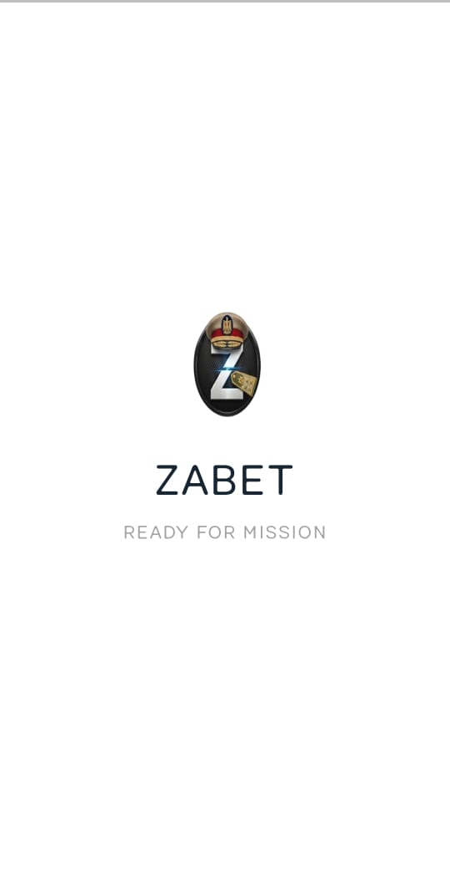<br/><sub>Screen 1</sub></td>
      <td align="center">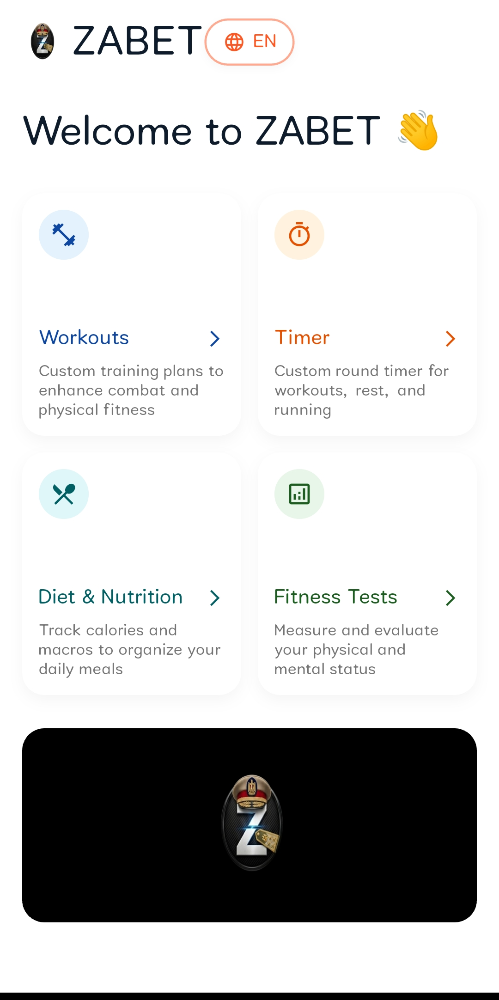<br/><sub>Screen 2</sub></td>
      <td align="center">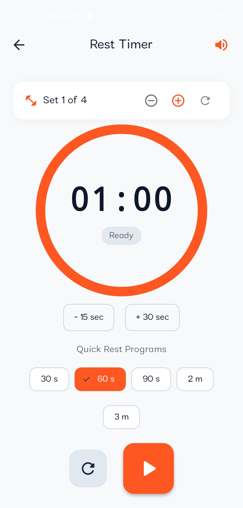<br/><sub>Screen 3</sub></td>
    </tr>
    <tr>
      <td align="center">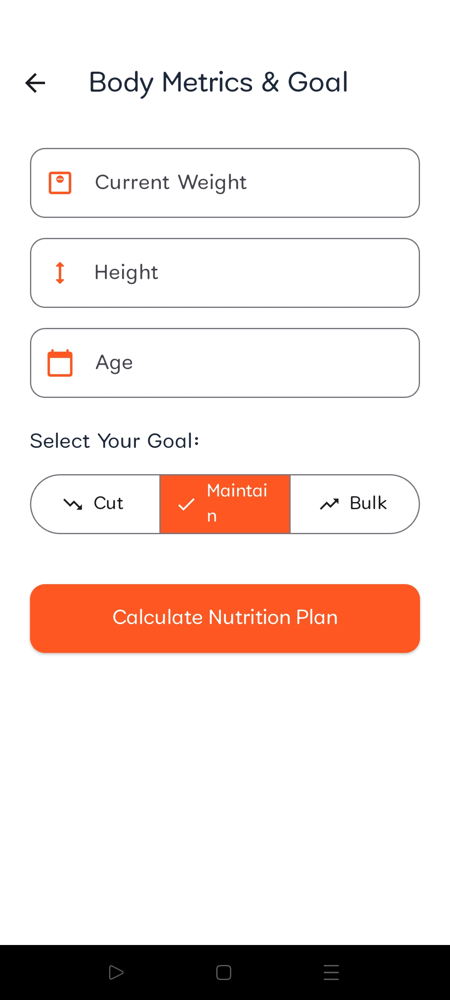<br/><sub>Screen 4</sub></td>
      <td align="center">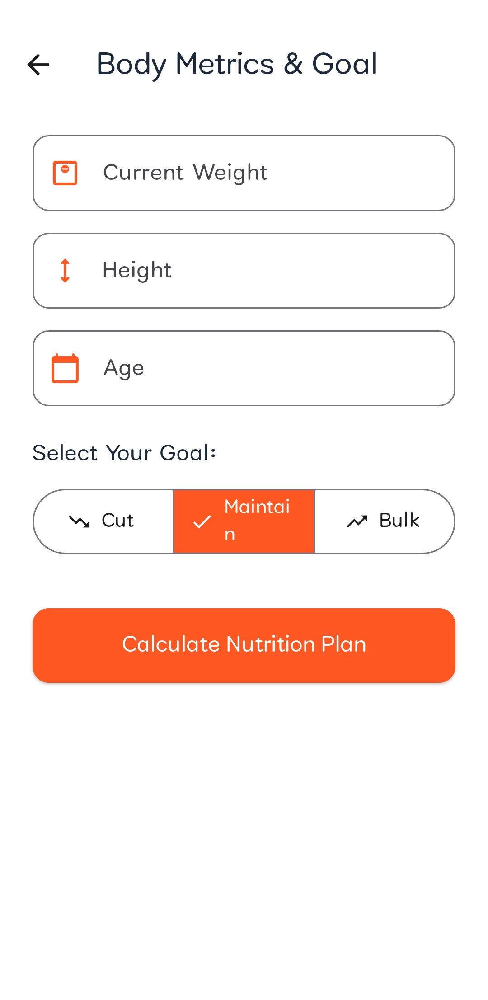<br/><sub>Screen 5</sub></td>
      <td align="center">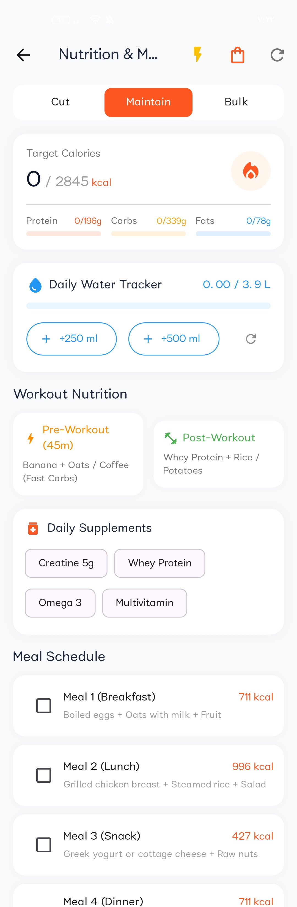<br/><sub>Screen 6</sub></td>
    </tr>
    <tr>
      <td align="center">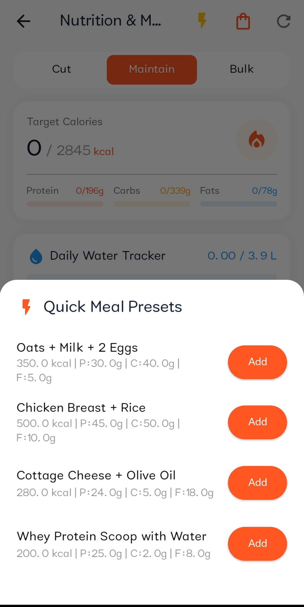<br/><sub>Screen 7</sub></td>
      <td align="center">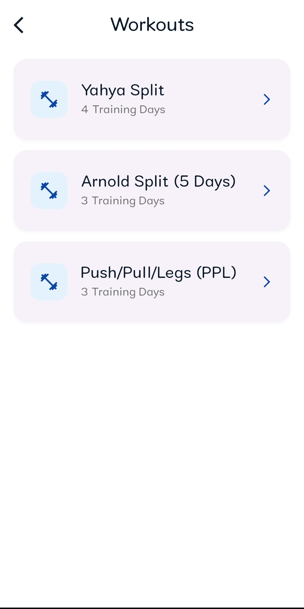<br/><sub>Screen 8</sub></td>
      <td align="center">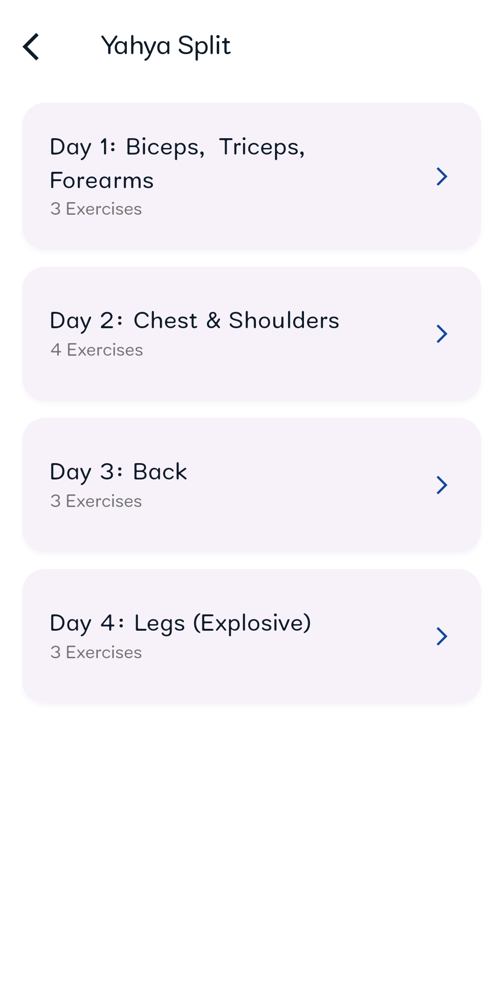<br/><sub>Screen 9</sub></td>
    </tr>
    <tr>
      <td align="center">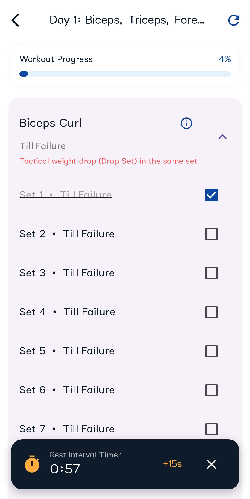<br/><sub>Screen 10</sub></td>
      <td align="center">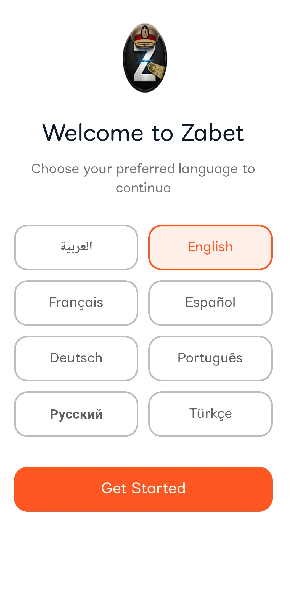<br/><sub>Screen 11</sub></td>
    </tr>
  </table>
</div>

---

### **APK Link**
[Download APK](https://drive.google.com/file/d/1Skm98N-UQUQU4s4omglb-4VgGeA8g7U6/view)

---

## 🚀 Getting Started

To clone and run this application locally, follow these steps:

### Prerequisites
* Flutter SDK (3.x or higher)
* Android Studio / VS Code / Project IDX
* Android Device or Emulator (API 21+)

### Installation

1. **Clone the repository:**
   ```bash
   git clone [https://github.com/yahyaemad887-alt/ZABET](https://github.com/yahyaemad887-alt/ZABET)
   
